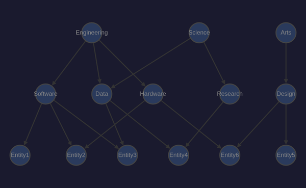
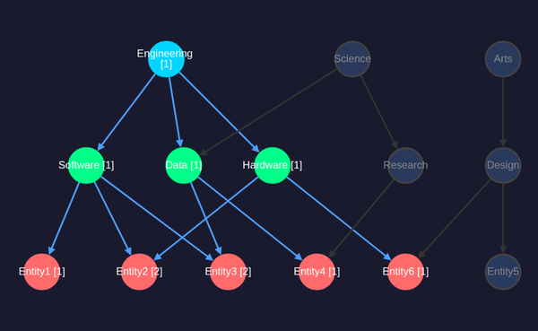
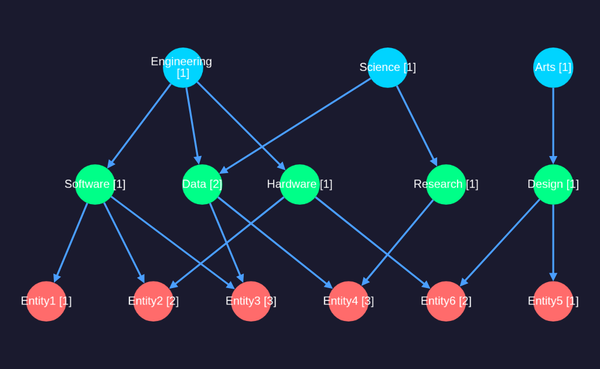

# Cytoscape.js + cytoscape-dagre DAG Visualization

## Library Info

* **Cytoscape.js** v3.33.1 — MIT License
* **cytoscape-dagre** v2.5.0 — MIT License
* [cytoscape.js.org](https://js.cytoscape.org/) | [GitHub](https://github.com/cytoscape/cytoscape.js)

## Build & Run

```bash
# Build
npx vite build --config vite.cytoscape.config.ts

# Test with Docker CDP
./manage-cdp.sh start cytoscape 9301 8301 dist-cytoscape
./manage-cdp.sh screenshot cytoscape assets/screenshots/cytoscape-dag-default.png 600x400
./manage-cdp.sh stop cytoscape
```

## Screenshots

### Default State (no selection)



All 14 nodes displayed in hierarchical DAG layout: 3 domains (top), 5 categories (middle), 6 entities (bottom). All nodes unselected (dark blue).

### Engineering Domain Selected



Selecting Engineering (d1) highlights it in cyan, its 3 child categories (Software, Data, Hardware) in green, and 5 reachable entities in red. Path counts shown in brackets (e.g., Entity3 [2] has 2 paths from Engineering).

### All Domains Selected



All 3 domains selected. Every node is active. Entity4 shows [3] paths (via Data from Engineering + Science, and via Research from Science). Data shows [2] (connected to both Engineering and Science).

## Source Files

* `src/vis/cytoscape/main.ts` — Cytoscape.js initialization, dagre layout, click handling
* `src/vis/cytoscape/index.html` — HTML page
* `vite.cytoscape.config.ts` — Vite build config (outputs to `dist-cytoscape/`)

## Observations

* **Dagre layout works well** — proper top-to-bottom hierarchy with minimal edge crossings
* **CSS-like styling** via selectors is intuitive; data-driven styles (`data(bgColor)`) allow per-node colors
* **Element update** requires rebuilding the full element set via `cy.json({ elements })` then re-running layout; no incremental style update API for data-driven properties
* **Bundle size** is 542 KB (176 KB gzipped) — moderate, dominated by the cytoscape core
* **Canvas-based rendering** — good performance for large graphs, but text rendering is less crisp than SVG
* **Node labels** wrap well with `text-wrap: wrap` and `text-max-width`
* **Click handling** is straightforward via `cy.on('tap', 'node', ...)`
