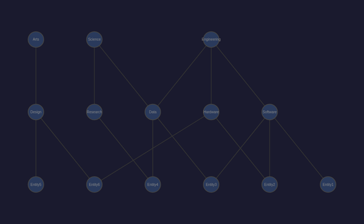
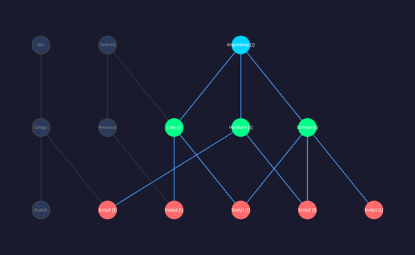
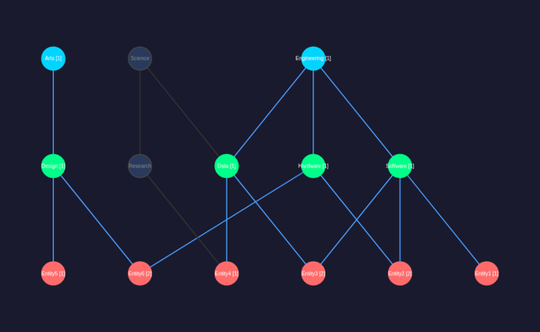

# D3.js + d3-dag Sugiyama SVG DAG Visualization

Pure SVG rendering using D3.js with d3-dag's Sugiyama algorithm for optimal hierarchical layout.

## Architecture

* **Layout**: d3-dag `sugiyama()` with `graphStratify()` — computes optimal layer assignment and crossing minimization
* **Rendering**: D3.js manual SVG — circles for nodes, curved paths for edges via `d3.curveBasis`
* **Interaction**: D3 click handlers → shared `handleNodeClick()` → full SVG re-render

## Node Styling by Tier

| Tier | Selected Color | Shape |
|------|---------------|-------|
| Domain | Cyan (`#00d4ff`) | Circle |
| Category | Green (`#00ff88`) | Circle |
| Entity | Red (`#ff6b6b`) | Circle |

Unselected nodes use `#2a3a5c` background. Labels show `[pathCount]` when active.

## Files

* `src/vis/d3dag/main.ts` — D3 + d3-dag implementation
* `src/vis/d3dag/index.html` — HTML shell
* `vite.d3dag.config.ts` — Vite build config

## Build & Test

```bash
npx vite build --config vite.d3dag.config.ts
./manage-cdp.sh start d3dag 9304 8304 dist-d3dag
./manage-cdp.sh screenshot d3dag assets/screenshots/d3dag-dag-default.png 600x400
```

## CDP Test API

```js
__d3dagState()        // Returns current GraphState
__d3dagClick(nodeId)  // Toggle node selection + re-render
```

## Screenshots

### Default (no selection)


### Engineering selected


### Engineering + Arts selected


## Key Design Decisions

* **Static layout, dynamic styling**: Sugiyama positions are computed once at startup. Only colors/labels update on interaction — no layout thrashing.
* **d3-dag `graphStratify`**: Accepts `parentIds` arrays naturally mapping our DAG edges (categories have multiple domain parents).
* **Curved edges**: `d3.curveBasis` with d3-dag's computed waypoints produces smooth, non-overlapping edge paths.
* **Arrow markers**: Separate SVG markers for active/inactive edge states.
