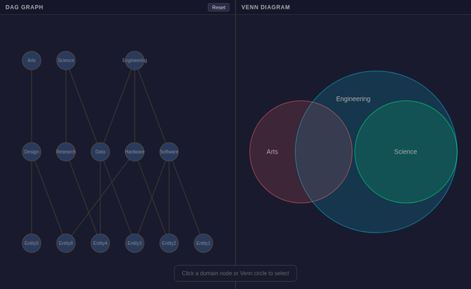
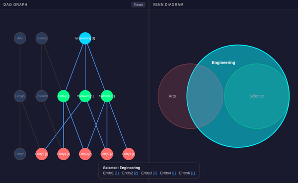
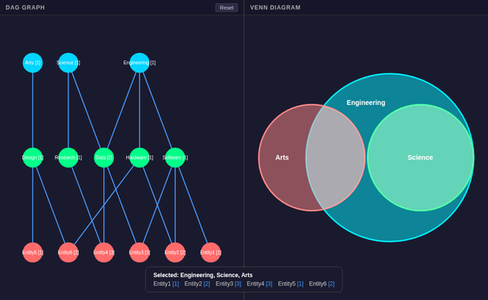

# Dual Panel — Synchronized DAG + Venn View

## Architecture

* **DAG Panel**: D3.js + d3-dag (Sugiyama layout, SVG)
* **Venn Panel**: @upsetjs/venn.js (area-proportional circles, SVG)
* **Shared State**: Single `GraphState` via the engine
* **Bundle**: 143KB total (48KB gzipped)

## Build and Run

```bash
npx vite build --config vite.dual.config.ts
./serve-demos.sh dual
# → http://localhost:4209
```

## Screenshots

### Default (unselected)



### Engineering selected



### All domains selected



## Interaction

* Click any node in the DAG panel to select/deselect it
* Click any circle/intersection in the Venn panel to select/deselect domains
* Both panels update simultaneously from the shared engine state
* Entity overlay shows active entities with path counts
* Reset button clears all selections

## Layout

Adaptive split based on viewport aspect ratio:

* **Wide viewport** (width > height): side-by-side (DAG left, Venn right)
* **Tall viewport** (height >= width): stacked (DAG top, Venn bottom)

Each panel gets 50% of the available space with a thin divider.

## CDP Testing

```bash
./manage-cdp.sh start dual 9309 8309 dist-dual
```

APIs:

* `__dualClick("d1")` — toggle domain/category/entity selection
* `__dualState()` — get current state (selectedDomains, all nodes)
* `__dualReset()` — clear all selections
