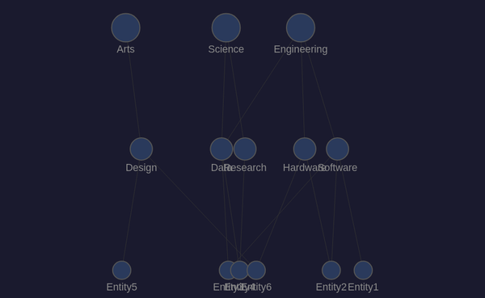
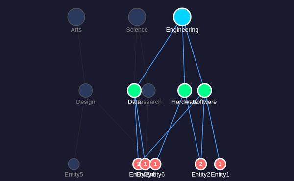
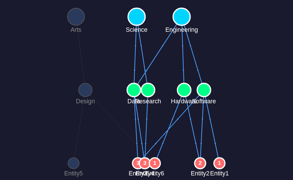

# force-graph DAG Visualization

DAG visualization using [force-graph](https://github.com/vasturiano/force-graph) (vasturiano) with Canvas 2D rendering and built-in `dagMode: 'td'` for top-down hierarchical layout.

## Architecture

* **Library**: force-graph v1.51+ (wrapper around d3-force with Canvas 2D)
* **Layout**: `dagMode: 'td'` — top-down DAG with `dagLevelDistance: 120`
* **Rendering**: Canvas 2D via custom `nodeCanvasObject`
* **Source**: `src/vis/forcegraph/main.ts`
* **Build config**: `vite.forcegraph.config.ts`
* **Output**: `dist-forcegraph/`

## Features

* Three-tier DAG layout: domains (top) → categories (middle) → entities (bottom)
* Custom node rendering with tier-specific colors and sizes
* Path count badges displayed inside entity nodes
* Directional animated particles on active edges (`linkDirectionalParticles`)
* Click-to-select/deselect domains with full state propagation
* Auto zoom-to-fit after layout stabilizes
* Exposed `window.__clickNode(id)` for CDP testing

## Node Styling

| Tier | Selected Color | Unselected Color | Radius |
|------|---------------|-----------------|--------|
| Domain | `#00d4ff` (cyan) | `#2a3a5c` | 14px |
| Category | `#00ff88` (green) | `#2a3a5c` | 11px |
| Entity | `#ff6b6b` (red) | `#2a3a5c` | 9px |

## Build & Test

```bash
# Build
npx vite build --config vite.forcegraph.config.ts

# Test with CDP
./manage-cdp.sh start forcegraph 9303 8303 dist-forcegraph
./manage-cdp.sh screenshot forcegraph assets/screenshots/forcegraph-dag-default.png 600x400
./manage-cdp.sh stop forcegraph
```

## Screenshots

### Default state (no selection)



### Engineering domain selected



### Engineering + Science selected



## Notes

* The charge force is strengthened to `-200` to spread same-tier nodes apart horizontally
* `cooldownTicks: 150` ensures the force layout stabilizes before zoom-to-fit
* `d3VelocityDecay: 0.4` helps the layout converge faster
* force-graph handles DAG constraint enforcement internally via dagMode
