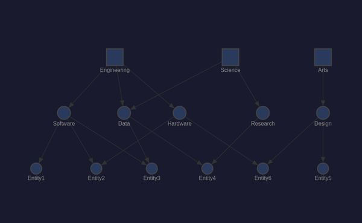
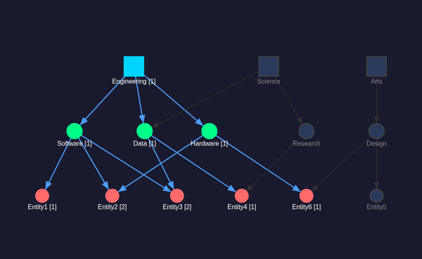
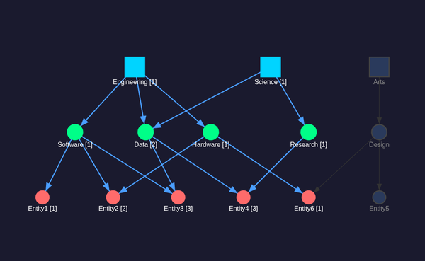

# @memgraph/orb + dagre DAG Visualization

Canvas-based graph visualization using [@memgraph/orb](https://github.com/memgraph/orb) with [dagre](https://github.com/dagrejs/dagre) for hierarchical layout computation.

## Architecture

Orb provides a canvas renderer with built-in pan/zoom/drag via d3-zoom and d3-drag. Since Orb has no built-in hierarchical layout engine, dagre computes node positions which are then applied via `orb.data.setNodePositions()`.

```
dagre (layout) → positions → Orb (canvas rendering)
```

## Key Implementation Details

* **Node types**: Orb `INodeBase` extended with `tier`, `selected`, `pathCount`
* **Edge types**: Orb `IEdgeBase` with `start`/`end` (Orb's required field names) + `active` flag
* **Layout**: dagre `rankdir: 'TB'`, `nodesep: 60`, `ranksep: 80`
* **Styling**: `setDefaultStyle()` with `getNodeStyle`/`getEdgeStyle` callbacks — colors by tier and selection state
* **Interaction**: `OrbEventType.NODE_CLICK` triggers `handleNodeClick()` from shared adapter, then full re-setup
* **Rendering**: Canvas-based (single `<canvas>` element), no DOM nodes per graph element

## Node Shapes

* Domains: square shape, size 18
* Categories: circle shape, size 14
* Entities: circle shape, size 12

## Refresh Strategy

On click, the entire graph data is re-setup via `orb.data.setup()` with fresh nodes/edges, dagre positions recomputed, and `orb.view.render()` called with `recenter()` callback.

## Files

* `src/vis/orb/main.ts` — Implementation
* `src/vis/orb/index.html` — HTML shell
* `vite.orb.config.ts` — Build config (outputs to `dist-orb/`)

## Build & Test

```bash
npx vite build --config vite.orb.config.ts
./manage-cdp.sh start orb 9307 8307 dist-orb
./manage-cdp.sh screenshot orb assets/screenshots/orb-dag-default.png
```

## CDP Testing

```bash
# Exposed globals for headless testing
window.__orbState()           # Returns current GraphState
window.__orbClick("d1")       # Simulate node click
```

## Screenshots

| State | Screenshot |
|-------|-----------|
| Default (unselected) |  |
| Engineering selected |  |
| Engineering + Science |  |
