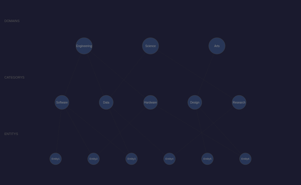
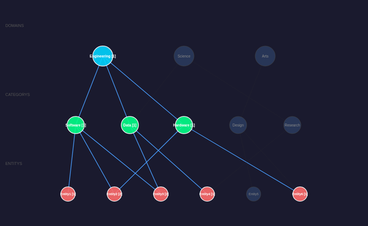
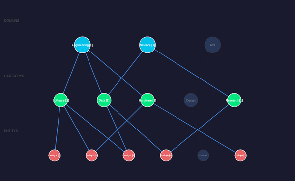

# reagraph (WebGL) DAG Visualization

## Overview

[reagraph](https://github.com/reaviz/reagraph) is a React-based WebGL graph visualization library built on Three.js. It renders nodes and edges using GPU-accelerated 3D graphics via `<canvas>` elements.

## Architecture

* **React component** — `App.tsx` uses `GraphCanvas` from reagraph with `layoutType="custom"` and manually computed hierarchical positions
* **SVG fallback overlay** — For headless/CDP environments where WebGL buffers aren't captured by `Page.captureScreenshot`, an SVG overlay renders the same graph using DOM elements
* **Shared adapter** — Imports `getVisState()`, `handleNodeClick()`, and `COLORS` from `src/vis/shared.ts`

## Files

```
src/vis/reagraph/
├── App.tsx           # Main React component (GraphCanvas + SVG fallback)
├── main.tsx          # React root render entry point
└── index.html        # HTML shell

vite.reagraph.config.ts   # Vite build config with @vitejs/plugin-react
dist-reagraph/            # Build output (gitignored)
```

## Build

```bash
npx vite build --config vite.reagraph.config.ts
```

## CDP Testing

```bash
./manage-cdp.sh start reagraph 9305 8305 dist-reagraph
./manage-cdp.sh screenshot reagraph assets/screenshots/reagraph-dag-default.png 600x400
./manage-cdp.sh stop reagraph
```

**Note:** WebGL rendering requires SwiftShader or GPU access in Docker. The implementation includes an SVG fallback that activates in headless Chrome environments where WebGL isn't available for screenshot capture.

## CDP API

```javascript
// Click a node (select/deselect)
__reagraphClick("d1")

// Get current engine state
__reagraphState()
```

## Screenshots

### Default state (no selection)



All 14 nodes in 3-tier hierarchy: 3 domains, 5 categories, 6 entities. Edges show connections in muted gray.

### Single domain selected (Engineering)



Engineering (cyan) selected — connected categories (Software, Data, Hardware) highlighted green, reachable entities shown red with path counts.

### Multiple domains selected (Engineering + Science)



Both Engineering and Science selected. Data category shows path count [2] (reachable from both domains). Research category activated by Science.

## Technical Notes

* **WebGL in headless Chrome**: Chromium's `--disable-gpu` flag prevents WebGL rendering. The SVG overlay provides a faithful 2D representation for automated testing
* **Bundle size**: ~1.5MB (Three.js + reagraph). Could be reduced with code splitting
* **Layout**: Custom layout with manual tier-based positioning (domains top, categories middle, entities bottom)
* **Interactivity**: Node click toggles domain selection, propagates through shared engine
