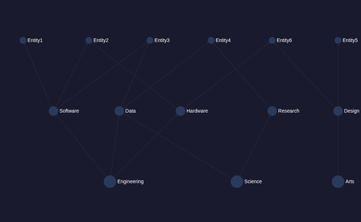
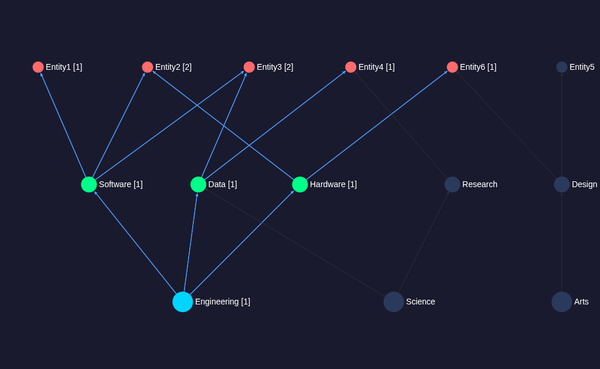
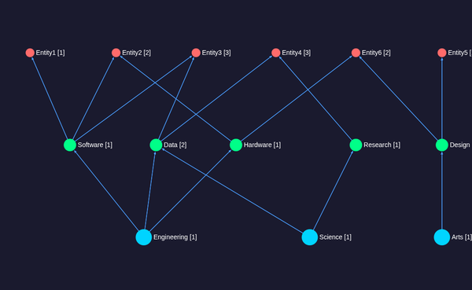

# Sigma.js v3 + Graphology DAG Visualization

WebGL-accelerated graph visualization using Sigma.js v3 with graphology as the data layer and dagre for hierarchical layout.

## Architecture

* **Sigma.js v3** — WebGL renderer for high-performance graph drawing
* **graphology** — Graph data structure with reactive attribute updates
* **dagre** — Directed acyclic graph layout algorithm (top-to-bottom hierarchy)

## Files

* `src/vis/sigma/main.ts` — Main visualization logic
* `src/vis/sigma/index.html` — HTML entry point
* `vite.sigma.config.ts` — Vite build config (outputs to `dist-sigma/`)

## How It Works

1. **Layout**: dagre computes hierarchical node positions (domains → categories → entities)
2. **Data**: graphology `Graph` stores nodes with `x`, `y`, `size`, `color`, `label` attributes
3. **Render**: Sigma WebGL renderer draws the graph with node/edge reducers for dynamic styling
4. **Interaction**: `clickNode` event triggers `handleNodeClick()` from the shared adapter, then updates graphology attributes reactively (Sigma re-renders automatically)

## Build

```bash
npx vite build --config vite.sigma.config.ts
```

## CDP Testing

Sigma.js requires WebGL, which needs special Chromium flags in headless mode:

```bash
# Standard manage-cdp.sh won't work because --disable-gpu blocks WebGL.
# Use manual container start with WebGL-enabled flags:
docker run -d \
  --name gvdv-cdp-sigma \
  -p 9306:9223 -p 8306:8080 \
  -v "$(pwd)/dist-sigma:/srv/app:ro" \
  --entrypoint /bin/bash \
  gvdv-cdp-test -c '
    cd /srv/app && npx -y serve -l 8080 -s --no-clipboard &
    sleep 2
    chromium --headless=new --no-sandbox --disable-dev-shm-usage \
      --use-gl=angle --use-angle=swiftshader-webgl --enable-webgl \
      --remote-debugging-port=9222 --window-size=1024,768 \
      --hide-scrollbars --force-device-scale-factor=1 \
      http://localhost:8080/ &
    sleep 3
    exec socat TCP-LISTEN:9223,fork,reuseaddr,bind=0.0.0.0 TCP:127.0.0.1:9222
  '
```

Ports: CDP 9306, HTTP 8306.

## CDP API

```javascript
// Get current engine state
__sigmaState()

// Programmatic node click (for testing)
__sigmaClick("d1")
```

## Screenshots

| State | Screenshot |
|-------|-----------|
| Default (unselected) |  |
| Engineering selected |  |
| All domains selected |  |

## Notes

* Sigma.js uses WebGL exclusively — no SVG/Canvas fallback
* Headless Chromium requires `--use-gl=angle --use-angle=swiftshader-webgl` for WebGL support
* Node sizes vary by tier: domain=18, category=14, entity=10
* graphology attribute updates trigger automatic Sigma re-renders (no manual refresh needed)
