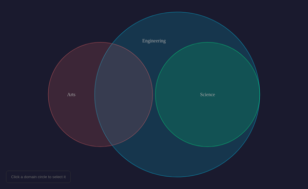
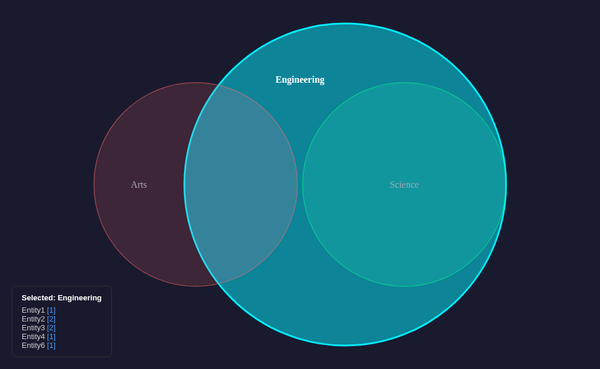
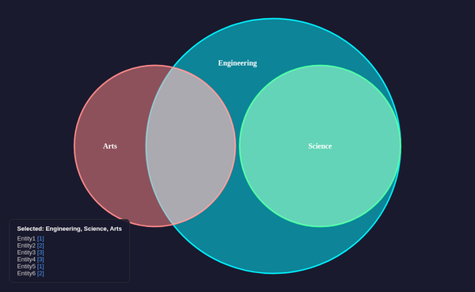

# Venn Diagram — @upsetjs/venn.js

## Library

* **Package**: `@upsetjs/venn.js` v2.0.0
* **License**: MIT
* **Renderer**: SVG (D3-based)
* **Bundle**: 64KB (22KB gzipped)

## Concept

Maps the DAG to a Venn diagram where:

* Each **domain** is a set (circle)
* **Entities** reachable from a domain are members of that set
* **Intersections** show shared entities between domains
* Circle sizes are area-proportional to entity count

With the master graph:

* Engineering → {x1, x2, x3, x4, x6} = 5 entities
* Science → {x3, x4} = 2 entities
* Arts → {x5, x6} = 2 entities
* Engineering ∩ Science = {x3, x4} = 2 shared
* Engineering ∩ Arts = {x6} = 1 shared

## Build and Run

```bash
npx vite build --config vite.venn.config.ts
./serve-demos.sh venn
# → http://localhost:4208
```

## Screenshots

### Default (unselected)



### Engineering selected



### All domains selected



## Interaction

* Click a domain circle to select/deselect it
* Click an intersection to toggle the first unselected domain in that group
* Entity list overlay shows active entities with path counts
* Hover highlights regions

## CDP Testing

```bash
./manage-cdp.sh start venn 9308 8308 dist-venn
```

APIs:

* `__vennClick("Engineering")` — toggle domain selection
* `__vennState()` — get current state

## Observations

* Area-proportional layout works well for showing relative set sizes
* Engineering circle dominates (5/6 entities) — visually accurate
* Intersection areas convey shared membership intuitively
* D3-based SVG renders perfectly in headless Chrome (no WebGL needed)
* Small bundle size (22KB gzipped) — lightest of all implementations
* `VennDiagram()` API is simple and configurable
