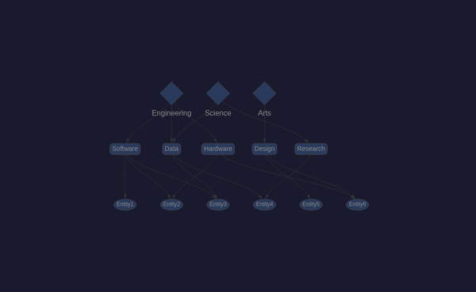
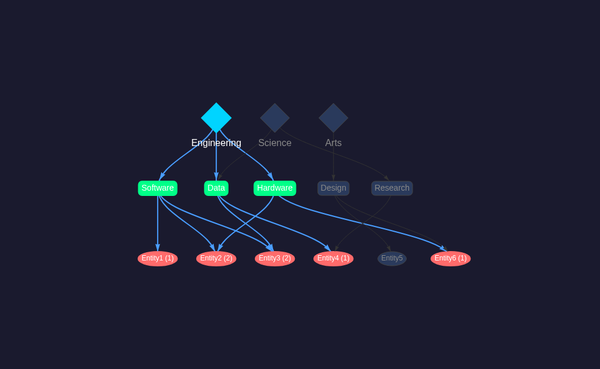
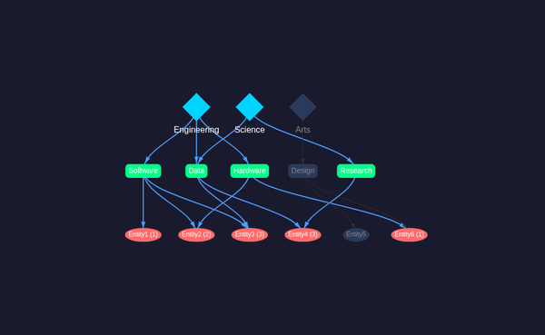

# vis-network Hierarchical DAG Visualization

## Overview

Uses [vis-network](https://visjs.github.io/vis-network/) with built-in hierarchical layout to render the 3-tier DAG (domains → categories → entities).

## Implementation

* **Layout**: Hierarchical top-down (`direction: 'UD'`) with `sortMethod: 'directed'`
* **Node shapes**: Diamond (domains), Box (categories), Ellipse (entities)
* **Levels**: domain=0, category=1, entity=2 — maps directly to vis-network's `level` property
* **Data management**: `vis.DataSet` for incremental node/edge updates on click
* **Physics**: Disabled (positions determined by hierarchical layout)

## Node Styling

| Tier | Shape | Selected Color | Unselected Color |
|------|-------|---------------|-----------------|
| Domain | Diamond | `#00d4ff` (cyan) | `#2a3a5c` |
| Category | Box | `#00ff88` (green) | `#2a3a5c` |
| Entity | Ellipse | `#ff6b6b` (red) | `#2a3a5c` |

Entity nodes display path counts when selected (e.g., "Entity3 (3)").

## Screenshots

### Default state (no selection)



All nodes in unselected state. Hierarchical layout clearly shows 3 tiers.

### Engineering selected



Selecting Engineering activates Software, Data, Hardware categories and their downstream entities. Path counts appear on entity nodes.

### Engineering + Science selected



With both domains selected, shared nodes like Data category and Entity3/Entity4 show higher path counts (3 paths each), demonstrating the Venn-overlap counting.

## Observations

* vis-network's hierarchical layout handles the DAG well with minimal configuration
* The `level` property directly maps to tier depth — no external layout algorithm needed
* `DataSet.update()` provides efficient incremental updates without full re-render
* Diamond shapes work well for distinguishing domain nodes at the top tier
* Edge routing with `cubicBezier` and `forceDirection: 'vertical'` keeps lines clean
* The built-in hover interaction provides good visual feedback

## Files

* `src/vis/visnetwork/main.ts` — visualization logic
* `src/vis/visnetwork/index.html` — HTML shell
* `vite.visnetwork.config.ts` — build configuration
* Build output: `dist-visnetwork/`

## CDP Testing

```bash
./manage-cdp.sh start visnetwork 9302 8302 dist-visnetwork
./manage-cdp.sh screenshot visnetwork assets/screenshots/visnetwork-dag-default.png 600x400
./manage-cdp.sh stop visnetwork
```
